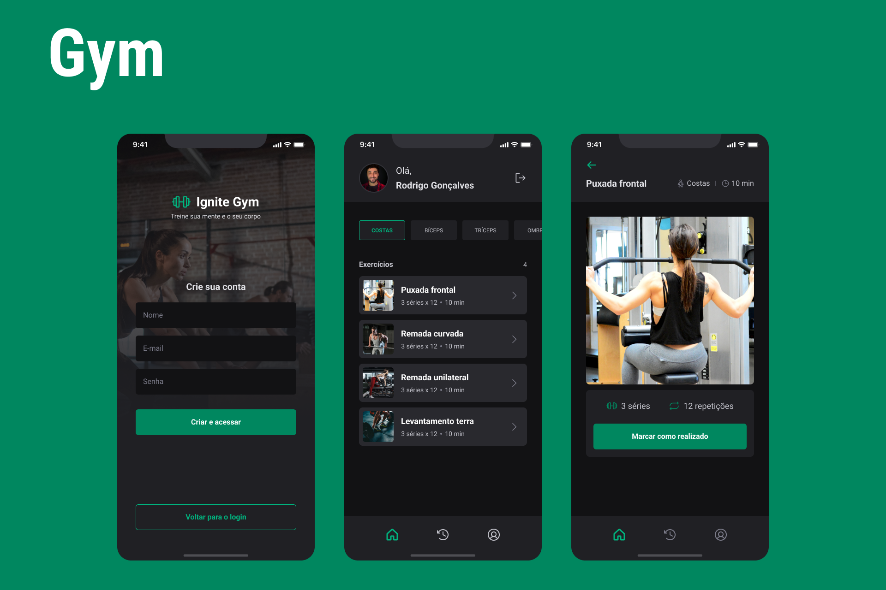

# Gym



## Sobre

O Gym é um app para gerenciar os exercícios feitos por você na academia, permite que voce crie e personalize sua conta e adicione seu histórico de exercícios.

## Instalação

```bash
git clone https://github.com/manoguii/gym.git
```

- Para rodar o projeto localmente
  - Mobile
    1. Primeiro você precisa acessar a pasta do ```mobile```
    2. Instale as dependências ```npm install```
    3. Execute a aplicação. ```npx expo start```
    4. Caso queira visualizar o app no seu dispositivo baixo o app ```expo``` e leia o QR code que aparece no terminal.
  - server
    1. Primeiro você precisa acessar a pasta da api ```server```
    2. Instale as dependências ```npm install```
    3. Criar as tabelas do banco de dados ```npm run migrate```
    4. Popular as tabelas no  banco de dados ```npm run seed```
    5. Execute a aplicação. ```npm run dev```
    6. Para visualizar a documentação da api acesse [http://localhost:3333/api-docs](http://localhost:3333/api-docs)
    7. Acesse `http://localhost:3333`

## Tecnologias

Algumas tecnologias utilizadas para construção da aplicação.

- React Native
- TypeScript
- Native Base
- React Hook Form
- Yup
- Async Storage
- Expo
- Axios
- Node.js
- Javascript

---

<center>Made with 💙 by Guilherme David</center>
